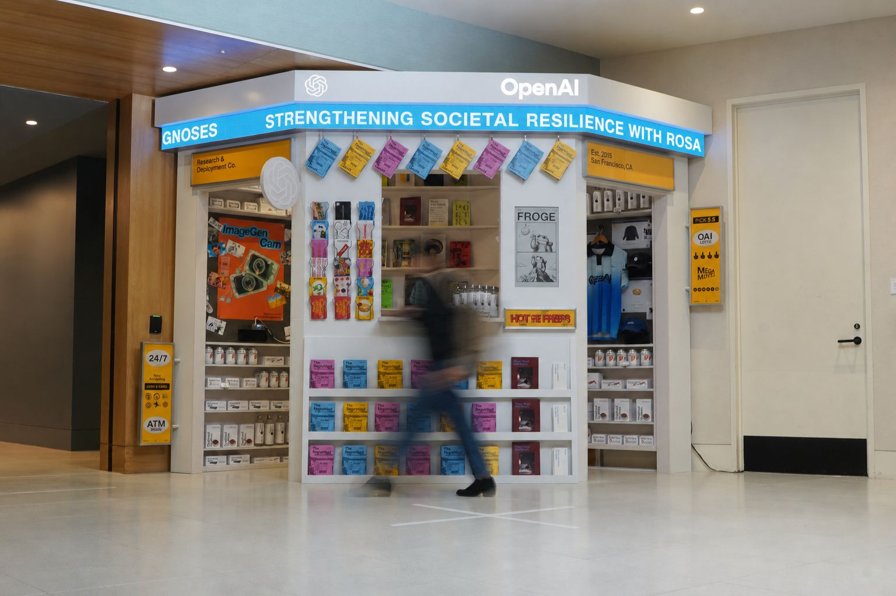
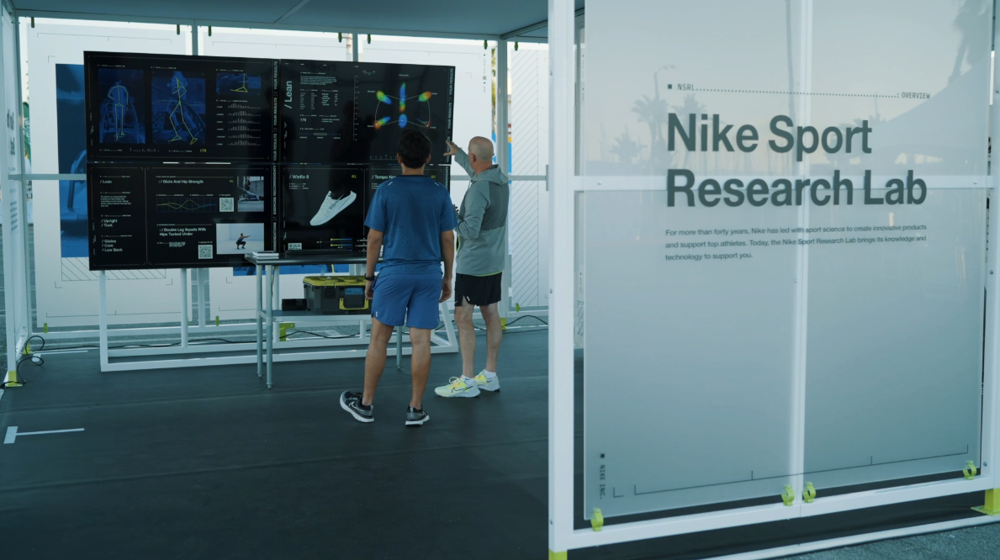

# Class 2 

## 🛠️ Drawing tools in p5js

#### p5js is built upon the html `<canvas>` [element](https://developer.mozilla.org/en-US/docs/Web/HTML/Element/canvas)

* p5js draws images in a specific way, and by default layers every drawing command on top of the previous one
* Shapes, image, text are the primary tools
* p5js draws in "immediate mode", where every graphical element needs to be redrawn each frame. This is very different than drawing with scene graphs, where objects are automatically managed in a hierarchical structure (Unity, THREE.js) and stored in graphics memory. This is also considered "retained mode".
* Not the most performant compared to other graphics libraries, but it's relatively easy to use and learn. Because of the performance tradeoff, p5js isn't as common in professional graphics work
* Very popular tool to create art and learn graphics techniques

#### `WEBGL` mode 

* Switches to a different graphics context that uses the GPU for rendering. It's still a `<canvas>` element, but has different drawing functions under the hood
* WebGL is faster and more capable - it can draw native 3D graphics, and can use shaders to create more advanced effects
* The WebGL coordinate system is at the center of the canvas
* WebGL doesn't use 2d `<canvas>` operations, so the resulting image can look a little different, even if you use the same drawing commands
* For example, WebGL is uglier in a lot of cases
  * [example](https://editor.p5js.org/cacheflowe/sketches/UYoSsOaV_)

#### The drawing context

* The graphics **context** refers the current image that's displayed, and the underlying technology used to draw and manipulate it, and keep track of it
* It also refers to the **current state** of the **canvas**, which is affected by the current settings for `fill`, `stroke`, `translate`, `rotate`, etc. You can think of the context as an object with persistent properties that change only when you explicitly change them. 
  * ```javascript
    {
      "context": {
        "fill": "#ff0000",
        "stroke": "#000000",
        "translate": [0, 0],
        "rotate": 0,
        "scale": [1, 1]
      }
    }
    ```
* [Example sketch about context](https://editor.p5js.org/cacheflowe/sketches/Ciw6RMl7G), with `push()` and `pop()` to save and restore the context state
* Adjust the following properties on the **context** before drawing a shape
  * `fill()`
  * `stroke()`
  * `translate()`
  * `push()` / `pop()`
  * `scale()`
  * `rotate()`
    * `CORNER` vs. `CENTER` ([example](https://editor.p5js.org/cacheflowe/sketches/nOll3v7bR))

## 🖼️ Images

* [image()](https://p5js.org/reference/p5/image/)
* Make sure you load the image with [loadImage()](https://p5js.org/reference/p5/loadImage/) before drawing
* [Interactive image example](https://editor.p5js.org/cacheflowe/sketches/H0JGQe2fu)

## 🎨 Color

* Understanding color
  * RGB (Red, Green, Blue) - [additive color](https://en.wikipedia.org/wiki/Additive_color)
  * [HSB/HSV](https://learnui.design/blog/the-hsb-color-system-practicioners-primer.html) (Hue, Saturation, Brightness/Value) - often more intuitive for creative coding
  * [Color picker tool](https://www.google.com/search?q=color+picker)
* p5js color functions
  * [colorMode()](https://p5js.org/reference/p5/colorMode/) - switch between RGB and HSB
  * `fill()` and `stroke()` accept different formats:
    * Grayscale: `fill(255)`
    * RGB: `fill(255, 0, 0)` 
    * RGBA (with alpha): `fill(255, 0, 0, 128)`
    * HSB: `colorMode(HSB); fill(180, 100, 100)`
  * [color()](https://p5js.org/reference/p5/color/) - store colors in variables
  * [lerpColor()](https://p5js.org/reference/p5/lerpColor/) - blend between two colors
* Color palettes
  * If you're not confident with color, use a [palette generator](https://coolors.co/palettes)
  * [Color theory basics](https://www.canva.com/colors/color-wheel/)

## 🅰️ Text

* Customizing our text
  * [text()](https://p5js.org/reference/p5/text/)- draw text to the canvas
  * [textSize()](https://p5js.org/reference/p5/textSize/) - set the text size
  * [textAlign()](https://p5js.org/reference/p5/textAlign/) - align text, horizontally and vertically
  * [textFont()](https://p5js.org/reference/p5/textFont/) - set the font
* Custom fonts
  * Use [`loadFont()`](https://p5js.org/reference/p5/loadFont/) to load a custom font file (.ttf, .woff, or .otf)
  * [Custom font example](https://editor.p5js.org/cacheflowe/sketches/uDy2zkb28) with [Google Fonts](https://fonts.google.com/). You can also upload your own font file to the sketch
  * [Example (WEBGL)](https://editor.p5js.org/cacheflowe/sketches/MLo0ywJEh)

## 🛠️ Iteration

* `for()` loops
  * Good for doing something many times
  * Works hand-in-hand with Arrays
* Nested `for()` loops
  * [drawGrid()](https://editor.p5js.org/cacheflowe/sketches/xTyKRWCNn)
  * [Grid 2D](https://editor.p5js.org/cacheflowe/sketches/xsYHe2SY_)
  * [Grid 2D w/labels](https://editor.p5js.org/cacheflowe/sketches/myxKaCofw)
  * [Grid 2D w/objects in array](https://editor.p5js.org/cacheflowe/sketches/U1nSNmcBQ)
  * [Grid 2D: Pixelated video/webcam](https://editor.p5js.org/cacheflowe/sketches/aLybN_TdB)
  * [Grid 3D](https://editor.p5js.org/cacheflowe/sketches/1S7L5IqjO)

## 📐 Relative Layout and dimensions

* Similar to [Responsive Web Design](https://web.dev/articles/responsive-web-design-basics), we can use the canvas width and height to position elements relative to the canvas size
* Live example of using `width` and `height` and multiplication to position elements relative to the canvas size
* [Layout demo](https://editor.p5js.org/cacheflowe/sketches/JVgGb7qd8)

## 🧑‍💼 Professional p5js use

* Not a common tool for my job, but useful in some cases
* Prototype [example](https://editor.p5js.org/cacheflowe/sketches/sIdQuK_3W)
  * Rounds of design & UX testing later, this ended up in a cool project for a client
  * I use TouchDesigner and Processing for my work, but there are places where p5js is the right tool for the job

Examples of p5js out in the wild:


> Powering custom LED panel array with the custom [Chromeyumm](https://github.com/cacheflowe/chromeyumm) browser and p5js as the [rendering engine](https://www.instagram.com/p/DXWiWpNDaKs/)


> p5js data visualizations built into a larger web app for a site-specific client project

## 📝 Homework

Read:

* "[Why Love Generative Art?](https://www.artnome.com/news/2018/8/8/why-love-generative-art)" - A history of the medium

Watch:

* [Robert Hodgin @ Eyeo 2014](https://vimeo.com/103537259) - watch at least the first 13 minutes
  * If you love this, watch [Robert Hodgin @ Eyeo 2012](https://vimeo.com/45526286)
* [Creative Code: Merging Design and Programming 〡Bruno Imbrizi](https://www.youtube.com/watch?v=Kdfw8t59OXI)

Browse & collect inspiration. Post your favorite sketches in Canvas!

* [OpenProcessing](https://www.openprocessing.org/)
* [CodePen](https://codepen.io/search/pens?q=p5js)
* [ShaderToy](https://www.shadertoy.com/)
* [Justin's inspiration links](../docs/inspiration.md)

### 🔎 The assignment

**Program a [poster](https://trcc.timrodenbroeker.de/programming-posters/)**

* Use shapes, color, type, images
* If you're not great with colors, use a [palette generator](https://coolors.co/palettes)
* Find [inspiration](https://www.google.com/search?q=bauhaus+poster+design) and borrow ideas if you're not a natural designer. If you really want to keep it simple, replicate an existing design, but credit the original designer in the comments.
* If you are a designer, try to make something more contemporary, or in your own style
* For stretch goals:
  * Use grids
  * Swap colors with a key press or mouse position
  * Make multiple posters
  * Randomize elements
  * Use a [library](https://p5js.org/libraries/)
* Make your canvas big, and use [this function](https://editor.p5js.org/cacheflowe/sketches/bTaASS9mv) to scale it down, so you can fit it onto screen

## 📋 Review code

* Present your ATLAS "A" programs
