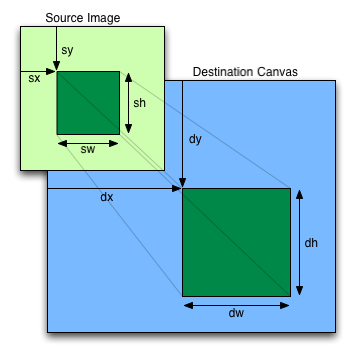

# Class 3

- Please add context about your assignment in Canvas 
  - What went well and what didn't
  - How you arrived at your result
  - A paragraph's worth of writing is plenty
  - This can be in the sketch comments, in a Canvas comment on your assignment page, or in the "paper" view when turning in
- Tidy Code command - how to group code together like you're writing an organized text document
  - grouping related lines with line spacing
  - consistency around spacing & indentation

## 🛠️ Advanced Image Tools

- `image()`
  - [Advanced image](https://editor.p5js.org/cacheflowe/sketches/DhW4CrQ18)
- `get()`
  - [Re-drawing images](https://editor.p5js.org/cacheflowe/sketches/RNbj-2IV0)
  - [p5 video example](https://editor.p5js.org/p5/sketches/Dom:_Video_Pixels)
- `copy()`
  - [marquee example](https://editor.p5js.org/cacheflowe/sketches/lXo4uD5fV)
  - 
- `texture()` w/`vertex()`
  - [UV coordinates](https://editor.p5js.org/cacheflowe/sketches/gQTxOUuFj)
  - [UV coordinates 2](https://editor.p5js.org/cacheflowe/sketches/eOxZ6_PJx)
- Gradients w/`vertex()`
  - [Fast background gradient](https://editor.p5js.org/cacheflowe/sketches/3ToQYymCE)
    - [Alternate w/drawingContext](https://editor.p5js.org/cacheflowe/sketches/hClcXo_Cm)
  - [Radial gradient](https://editor.p5js.org/cacheflowe/sketches/W-vOOSTO6)
- More exercises
  - [https://creative-coding.decontextualize.com/media/](https://creative-coding.decontextualize.com/media/)
  - [https://creative-coding.decontextualize.com/video/](https://creative-coding.decontextualize.com/video/)
- Advanced `context` topics
  - [drawingContext](https://p5js.org/reference/p5/drawingContext/) - gives you access to the underlying canvas context
    - [Glow Example](https://editor.p5js.org/cacheflowe/sketches/QMAE-qmRs)
  - [Clipping](https://editor.p5js.org/cacheflowe/sketches/-tO_SsjsC)
  - [Dynamic Masking](https://editor.p5js.org/cacheflowe/sketches/Tlx3KwDHI)
    - [Fancier Masking](https://editor.p5js.org/cacheflowe/sketches/l7xQ9dh64)

## 🛠️ Shaping our sketches

- Remapping numbers
  - User input
  - [Sliders](https://editor.p5js.org/cacheflowe/sketches/t7su_ViJ3)
  - [Random numbers](https://happycoding.io/tutorials/p5js/random)
  - Data
  - [noise()](https://p5js.org/reference/p5/noise/)
    - [example: noise grid offset](https://editor.p5js.org/cacheflowe/sketches/rTspcZzcf) 
    - [example: noise circles](https://editor.p5js.org/cacheflowe/sketches/MsjQH_kPi)
    - [example: textured noise mesh](https://editor.p5js.org/cacheflowe/sketches/XVQjjklv2)
  - sin() [example](https://editor.p5js.org/cacheflowe/sketches/WpJ24V4vq)
    - [Making generative art with simple mathematics](https://www.hailpixel.com/articles/generative-art-simple-mathematics)
    - TD: `lfo`/`pattern`/`function` CHOPs
  - lerp() [example](https://editor.p5js.org/cacheflowe/sketches/GemonFb9A)
  - map() [example](https://editor.p5js.org/cacheflowe/sketches/v88Rfyxhi)
  - modulo `%` [example](https://editor.p5js.org/cacheflowe/sketches/O9JM1Lp0n)
- Normalizing numbers
- Using `map()` - Live demo
  - Map mouse input - normalize and use for rotation
  - Map time (seconds to screen width)

## ⏱️ Time

- [Time, according to p5js](https://editor.p5js.org/cacheflowe/sketches/EdkIstnmFL):
  - `second()`, `minute()`, `hour()` uses your system clock
  - Track `millis()` for custom/precise time intervals
  - `frameCount % 60`
  - `nf()`
  - `deltaTime`
- Time according to TouchDesigner (live demo)

## 📝 Homework

Read:

- [On Meta-Design and Algorithmic Design Systems](https://runemadsen.com/blog/on-meta-design-and-algorithmic-design-systems/) by Rune Madsen
  - [MIT Media Lab's Brilliant New Logo Has 40,000 Permutations](https://www.fastcompany.com/1663378/mit-media-labs-brilliant-new-logo-has-40000-permutations-video)
  - [Cacheflowe - Nightlines](https://cacheflowe.com/art/physical/nightlines-t-shirt)

Watch:

- [Secrets of Game Feel and Juice](https://www.youtube.com/watch?v=216_5nu4aVQ)
- [Juice it or lose it](https://www.youtube.com/watch?v=Fy0aCDmgnxg)
  - See how animation effects can give an otherwise boring game lots of personality

Choose a secondary tool to investigate this semester. Some suggestions:

- Web tech: html/css/canvas/svg
  - THREE.js
  - React / react-three-fiber
- Unity or Unreal
- TouchDesigner
- VVVV
- Processing
- openFrameworks
- Nannou
- OpenRNDR
- Sonic Pi
- Tidal Cycles or Strudel
- Chuck

### 🔎 The assignment

**Build a clock**

- Textual, graphical, or both
- Make it abstract or conceptual, not a [literal clock](https://editor.p5js.org/p5/sketches/Input:_Clock)
- Some ideas
  - Use [millis()](https://p5js.org/reference/p5/millis/) for fine-grained time display
  - Build a countdown clock?
    - How long until you graduate, or other big life milestones?
    - How many years do you have left to live? Use variables to calculate
    - [Doomsday Clock](https://thebulletin.org/doomsday-clock/current-time/)
  - Show multiple time zones, or use an invented time scale
  - Does IRL time of day influence the color or drawing style?
  - Add sound
  - Apply time to your favorite activity
  - Reveal the rhythm of time with shapes
  - Use Javascript for more [Date functions](https://flaviocopes.com/javascript-dates/)
  - Turn the time into another "poster" and change the content depending on the time of day
- Inspiration
  - [Raven Kwok: Time](http://ravenkwok.com/time/)
  - [Humans since 1982: A Million Times](https://vimeo.com/60491636)
  - [Reza Ali: Reactions](https://www.instagram.com/p/CBogs4FH4E0/)
- Steps
  - Sketch it out on paper
  - Write some code, see if it sticks
    - Sometimes the code will lead us down different, interesting paths
  - Pivot when something isn't working and try a different approach

## 📋 Review code

- Present your posters

