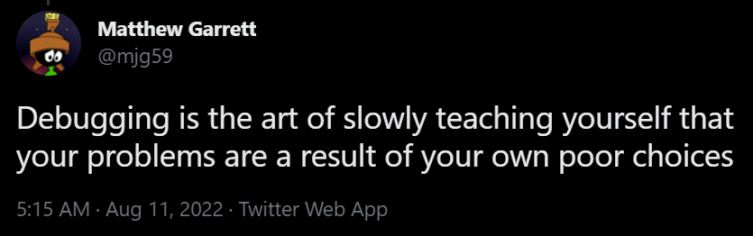
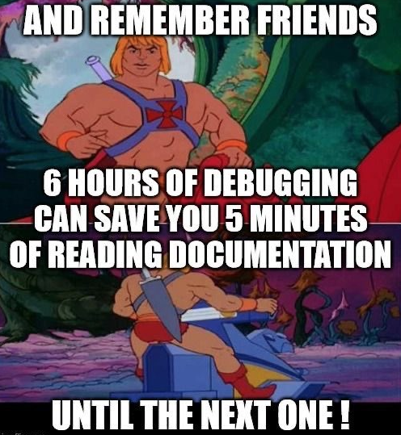
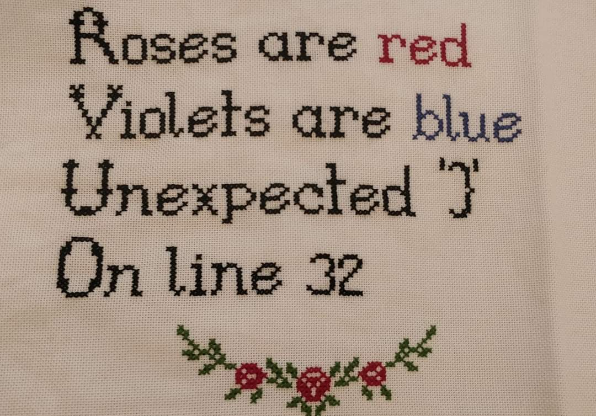
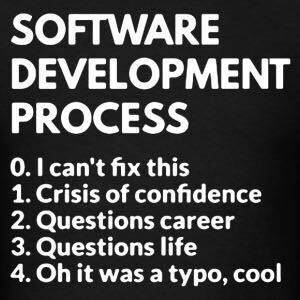

# Class 3

- Please add context about your assignment in Canvas 
  - What went well and what didn't
  - How you arrived at your result
  - A paragraph's worth of writing is plenty
  - This can be in the sketch comments, in a Canvas comment on your assignment page, or in the "paper" view when turning in
- Tidy Code command - how to group code together like you're writing an organized text document
  - grouping related lines with line spacing
  - consistency around spacing & indentation
- Finding nice colors: https://color.adobe.com/create/color-wheel
- Glow effect example, fast linear gradient example
- Oct 25 (Sat) art show for CTD class - w/Livvy & The Company
- **Creative Coding Art Show**
  - Saturday, October 25, evening (exact time TBD)
  - 2101 W 29th Ave, Denver, CO 80202
  - Hosted by the [Creative Code Denver Meetup](https://www.meetup.com/creative-code-denver/) at [The Company](https://thecompany.social/).
- Office hours start in earnest this week on Thursdays (4-6pm)
- NBM install last week

## 🛠️ Programming Languages

[Language differences & use-cases](https://www.quora.com/What-are-the-differences-that-exist-between-programming-languages/answer/James-Barton-129)

[Typing](https://en.wikipedia.org/wiki/Type_system)
- > In computer programming, a **type system** is a logical system comprising a set of rules that assigns a property called a type (for example, **integer**, **floating point**, **string**) to every term (a word, phrase, or other set of symbols). Usually the terms are various language constructs of a computer program, such as **variables**, **expressions**, **functions**, or **modules**. A type system dictates the operations that can be performed on a term. For variables, the type system determines the allowed values of that term.  Type systems formalize and enforce the otherwise implicit categories the programmer uses for algebraic data types, data structures, or other data types, such as "string", "array of float", "function returning boolean".
- [Type System for Javascript](https://dev.to/melodyleonard/type-system-for-javascript-1c1a): 
  - > JavaScript is a dynamically-typed language. What this means is that it performs type checking at runtime.   Take for instance a language like java or C++ which is a statically-typed language. Type checking in such language is performed at compile time. This is very useful as it warns the programmer of all type errors before the code executes successfully. This way, programmers are subjected to [fewer errors].
  - > JavaScript is a weakly typed language. It recognizes different data types (numbers, strings, etc.), but doesn't use them too strictly, trying to convert data when it seems reasonable. [Many] expressions that don't work in other languages work perfectly well in JavaScript. Try to perform any arithmetic operation (except addition) with strings or another data type (except when both operands are numbers or strings consisting only of numbers). You will see that they always work and return NaN, which makes sense.  In strongly typed languages, adding a number to a string won't work. ([Source](https://code-basics.com/languages/javascript/lessons/data-types-weak-typing))
- Video: [Typing: Static vs Dynamic, Weak vs. Strong](https://www.youtube.com/watch?v=C5fr0LZLMAs)

Programming paradigms:
- [Object-oriented](https://www.youtube.com/watch?v=m_MQYyJpIjg) (imperative)
- [Functional](https://www.youtube.com/watch?v=XGNYDjyD6G8) (declarative)
  - [Unleash JavaScript's Potential with Functional Programming](https://janhesters.com/blog/unleash-javascripts-potential-with-functional-programming)
- [And others](https://en.wikipedia.org/wiki/Programming_paradigm)

Languages update over time:
- [Javascript history](https://www.educative.io/blog/javascript-versions-history)

## 🛠️ IDEs

- IDEs - what can they do for you?
  - An IDE (Integrated Development Environment) lets you write, compile, and run code all in one place
  - They're built specifically for certain languages and have tools to help you write code faster and with fewer errors
  - They can be customized with plugins and themes
- [REPLs](https://en.wikipedia.org/wiki/Read%E2%80%93eval%E2%80%93print_loop)
  - [Online-REPs-and-REPLs](https://joel.franusic.com/Online-REPs-and-REPLs)

## 🛠️ Professional AI coding setup

* Read [Coding and learning with AI](../docs/learning-with-ai.md) if you haven't yet - this section is about the *hands-on setup*, not the philosophy
* Pick an AI-assisted editor
  * [VS Code](https://code.visualstudio.com/) + [GitHub Copilot](https://github.com/features/copilot) or [Claude Code](https://claude.com/product/claude-code) - most common professional setup right now
  * [Cursor](https://www.cursor.com/) - a fork of VS Code, built AI-first
  * Others: Windsurf, Replit, Gemini CLI
* What's actually going on under the hood
  * Inline suggestions vs. chat vs. full agentic "vibe coding" - a spectrum, not one thing
  * Context matters most - the AI can only work with what it can see (open files, terminal output, instructions you give it)
* Giving the AI durable context/instructions
  * **AGENTS.md** (or `CLAUDE.md`, `.cursorrules`, etc) - a file in your project that tells the AI tool your conventions, constraints, and preferences, so you don't repeat yourself every session
  * **Skills** - packaged, reusable instructions for a specific kind of task (a deploy checklist, a code review style) that the AI can invoke by name
  * **MCP servers** ([Model Context Protocol](https://modelcontextprotocol.io/)) - lets an AI tool call out to external tools/data (a database, a design tool, a browser) beyond just reading/writing files
* Routing - not every task needs the biggest/most expensive model
  * Different tools let you pick a model per-task (fast/cheap vs. slow/capable)
  * Worth understanding what you're actually paying for (in money, time, or both)
* **Live demo**: setting up a project with an AGENTS.md file and watching the difference it makes

## 🛠️ Debugging

Since we just set up an AI coding assistant above, this is a great addition to your debugging toolkit too - but see [Coding and learning with AI](../docs/learning-with-ai.md) for how to lean on it without atrophying your own debugging skills.

### Resources

* [p5js Debugging article](https://p5js.org/tutorials/field-guide-to-debugging/)
* [Errors in JavaScript](https://www.youtube.com/watch?v=O0EHKBi7iXU)
* ["Expert Software Developers' Approach to Error"](https://www.youtube.com/watch?v=UNMF5AS4SLg)
* [67 Weird Debugging Tricks Your Browser Doesn't Want You to Know](https://alan.norbauer.com/articles/browser-debugging-tricks)

### What to do when something doesn't work

* Does your IDE point out any syntax problems?
* Is there an error message in the console?
  * Is there a "[stack trace](https://en.wikipedia.org/wiki/Stack_trace)"?
* Check your syntax
* Check for typos
* Can you make a more basic version of the code do something?
* Double-check the documentation
* Do some Googling - has someone else had this problem?
* Get help from ChatGPT or Copilot

### General debugging

* Reference errors (is your code pointing to the right thing?)
* `console.log()` / `println()`
* Debuggers - [live demo](http://localhost/haxademic.js/demo/#three-scene)

### Graphical debugging

"Why aren't things drawing the way I expect them to?"

* It's hard, because there as less-obvious ways to identify a problem
* If something isn't displaying, can you make a simpler version?
* Add a "debug view"
  * In GLSL (shaders), there's no textual logging or output, so developers will draw various textures and stages of pixel operations to the screen to decipher what might be happening
  * [#debugviewart](https://www.instagram.com/explore/tags/debugviewart/)

## 🛠️ Shaping our sketches

- Remapping numbers
  - User input
  - [Sliders](https://editor.p5js.org/cacheflowe/sketches/t7su_ViJ3)
  - [Random numbers](https://happycoding.io/tutorials/p5js/random)
  - Data
  - [noise()](https://p5js.org/reference/p5/noise/)
    - [example: noise grid offset](https://editor.p5js.org/cacheflowe/sketches/rTspcZzcf) 
    - [example: noise circles](https://editor.p5js.org/cacheflowe/sketches/MsjQH_kPi)
    - [example: textured noise mesh](https://editor.p5js.org/cacheflowe/sketches/XVQjjklv2)
  - sin() [example](https://editor.p5js.org/cacheflowe/sketches/WpJ24V4vq)
    - [Making generative art with simple mathematics](https://www.hailpixel.com/articles/generative-art-simple-mathematics)
    - TD: `lfo`/`pattern`/`function` CHOPs
  - lerp() [example](https://editor.p5js.org/cacheflowe/sketches/GemonFb9A)
  - map() [example](https://editor.p5js.org/cacheflowe/sketches/v88Rfyxhi)
  - modulo `%` [example](https://editor.p5js.org/cacheflowe/sketches/O9JM1Lp0n)
- Normalizing numbers
- Using `map()` - Live demo
  - Map mouse input - normalize and use for rotation
  - Map time (seconds to screen width)

## ⏱️ Time

- [Time, according to p5js](https://editor.p5js.org/cacheflowe/sketches/EdkIstnmFL):
  - `second()`, `minute()`, `hour()` uses your system clock
  - Track `millis()` for custom/precise time intervals
  - `frameCount % 60`
  - `nf()`
  - `deltaTime`
- Time according to TouchDesigner (live demo)

## 🛠️ Animation

* Exercises:
  * Intro to [basic movement](https://editor.p5js.org/p5/sketches/Motion:_Bounce)
  * And more [examples/exercises](https://creative-coding.decontextualize.com/changes-over-time/)
* Real-time coding vs scripting or event-based or reactive environments
  * `noLoop()` option in p5.js

## 📝 Homework:

Read:

- [On Meta-Design and Algorithmic Design Systems](https://runemadsen.com/blog/on-meta-design-and-algorithmic-design-systems/) by Rune Madsen
  - [MIT Media Lab's Brilliant New Logo Has 40,000 Permutations](https://www.fastcompany.com/1663378/mit-media-labs-brilliant-new-logo-has-40000-permutations-video)
  - [Cacheflowe - Nightlines](https://cacheflowe.com/art/physical/nightlines-t-shirt)

Watch:

- [Secrets of Game Feel and Juice](https://www.youtube.com/watch?v=216_5nu4aVQ)
- [Juice it or lose it](https://www.youtube.com/watch?v=Fy0aCDmgnxg)
  - See how animation effects can give an otherwise boring game lots of personality

Choose a secondary tool to investigate this semester. Some suggestions:

- Web tech: html/css/canvas/svg
  - THREE.js
  - React / react-three-fiber
- Unity or Unreal
- TouchDesigner
- VVVV
- Processing
- openFrameworks
- Nannou
- OpenRNDR
- Sonic Pi
- Tidal Cycles or Strudel
- Chuck

**Build a clock**

- Textual, graphical, or both
- Make it abstract or conceptual, not a [literal clock](https://editor.p5js.org/p5/sketches/Input:_Clock)
- Some ideas
  - Use [millis()](https://p5js.org/reference/p5/millis/) for fine-grained time display
  - Build a countdown clock?
    - How long until you graduate, or other big life milestones?
    - How many years do you have left to live? Use variables to calculate
    - [Doomsday Clock](https://thebulletin.org/doomsday-clock/current-time/)
  - Show multiple time zones, or use an invented time scale
  - Does IRL time of day influence the color or drawing style?
  - Add sound
  - Apply time to your favorite activity
  - Reveal the rhythm of time with shapes
  - Use Javascript for more [Date functions](https://flaviocopes.com/javascript-dates/)
  - Turn the time into another "poster" and change the content depending on the time of day
- Inspiration
  - [Raven Kwok: Time](http://ravenkwok.com/time/)
  - [Humans since 1982: A Million Times](https://vimeo.com/60491636)
  - [Reza Ali: Reactions](https://www.instagram.com/p/CBogs4FH4E0/)
- Steps
  - Sketch it out on paper
  - Write some code, see if it sticks
    - Sometimes the code will lead us down different, interesting paths
  - Pivot when something isn't working and try a different approach

## 📋 Review code

- Present your posters

