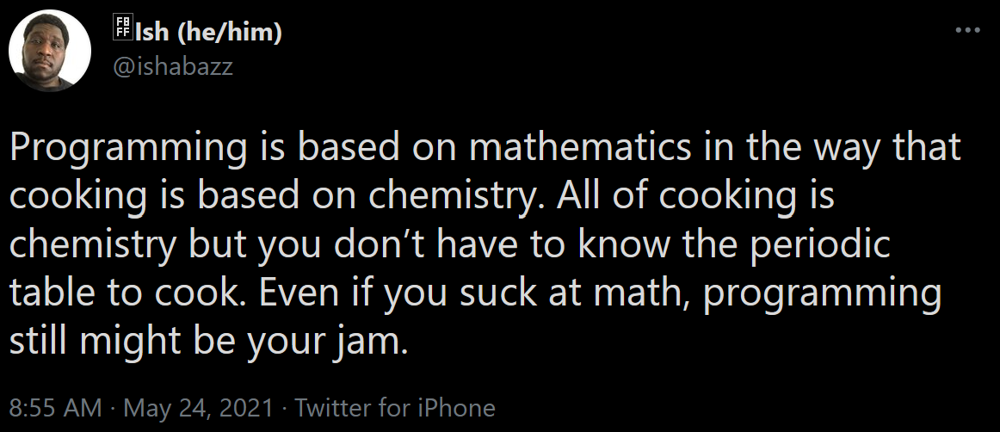

# Class 4

## 🛠️ Strings

- The [String object](https://developer.mozilla.org/en-US/docs/Web/JavaScript/Reference/Global_Objects/String) @ MDN
- Practical uses
  - `indexOf()`
  - `charAt()`
  - `substring()`
  - `trim()`
  - `match()`
  - `replace()`
  - Live demo in REPL
- Fun uses
  - [Typing effect](https://editor.p5js.org/cacheflowe/sketches/SZuK1L9Ij)
  - [Random character effect](https://editor.p5js.org/cacheflowe/sketches/_HvhP2BON)
- Text manipulation [exercises](https://creative-coding.decontextualize.com/text-and-type/) to try out
- Live demo: replace characters with fun characters

## 🛠️ Typography

Custom fonts & tools

* Examples from earlier classes
  * [Custom fonts example](https://editor.p5js.org/cacheflowe/sketches/uDy2zkb28)
  * [WEBGL example](https://editor.p5js.org/cacheflowe/sketches/MLo0ywJEh)
* p5js font-parsing extensions
  * [textToPoints()](https://p5js.org/reference/p5.Font/textToPoints/)
  * [textToContours()](https://p5js.org/reference/p5.Font/textToContours/)
  * [textToModel()](https://p5js.org/reference/p5.Font/textToModel/)
  * [textToPaths()](https://p5js.org/reference/p5.Font/textToPaths/)

Kinetic type

* Kinetic typography artists [inspo](../docs/inspiration.md#kinetic-typography)
* Kinetic typography examples by Cacheflowe
  * [WTF?](https://cacheflowe.com/art/digital/wtf)
  * [What Whut Wat](https://cacheflowe.com/art/digital/what-whut-wat)
  * [Wobble](https://cacheflowe.com/art/digital/wobble)
    * [Quick demo](https://editor.p5js.org/cacheflowe/sketches/XpVomQq1S)
  * [Drip](https://cacheflowe.com/art/digital/drip)
  * [Wavy](https://cacheflowe.com/art/digital/wavy)
* Live demo - draw individual characters & consider kerning

## 🛠️ Math

- [Floating Point Math](https://0.30000000000000004.com/)
- [Trigonometry (Making generative art with simple mathematics)](https://www.hailpixel.com/articles/generative-art-simple-mathematics)
  - [Polar (circular) coordinates](https://editor.p5js.org/cacheflowe/sketches/22CiPOyiN)
  - [Circular oscillation](https://editor.p5js.org/cacheflowe/sketches/QazkuY-bZ)
  - [Divide an arc](https://editor.p5js.org/cacheflowe/sketches/_9FdBq40-)
  - [Sketch: Drive a car](https://editor.p5js.org/cacheflowe/sketches/SSqX9j2X-)
- [Vectors](https://p5js.org/reference/p5.Vector/sub/)
  - Keep track of 2d/3d coordinates and do all of the math for you!
- [Basic physics](https://editor.p5js.org/cacheflowe/sketches/488Fdh1O1)
  - [Introduction to Matter.js - The Nature of Code](https://www.youtube.com/watch?v=urR596FsU68)
  - [Matter.js example](https://editor.p5js.org/mahdadbor/sketches/pSIth_A61)
- [Collision detection](https://www.jeffreythompson.org/collision-detection/)
- [Raytracing](https://www.shadertoy.com/view/DstcWn) / [Raymarching](https://www.shadertoy.com/view/wlSGWy)
- FFT
  - [p5.js Coding Tutorial | Music Visualization with FFT](https://www.youtube.com/watch?v=8O5aCwdopLo)
- [Coding Math](https://www.youtube.com/user/codingmath) video series by Keith Peters
- [Soulwire's Math for Motion](https://soulwire.co.uk/math-for-motion/)
- ...and so much more

## 🛠️ Animation

* Exercises:
  * Intro to [basic movement](https://editor.p5js.org/p5/sketches/Motion:_Bounce)
  * And more [examples/exercises](https://creative-coding.decontextualize.com/changes-over-time/)
* Real-time coding vs scripting or event-based or reactive environments
  * `noLoop()` option in p5.js
* Looping Animations
  - [Example loops](https://cacheflowe.com/art/digital) from Justin
  - [Time, according to p5js](https://editor.p5js.org/cacheflowe/sketches/EdkIstnmFL)

## 📝 Homework

Read:

- [Line](https://winterbloed.be/line/) by @wblut
  - Discusses OOP techniques around the concept of a `line()`
- [Sketching with Math and Quasi Physics](https://kynd.github.io/p5sketches/)

Watch:
  
- [Exploring Emergence](https://www.youtube.com/watch?v=gOqOyb51prU) by Andy Lomas
- [CD Lecture: Kiel Mutschelknaus](https://www.youtube.com/watch?v=u98hjQusdEU) (Kinetic Typography concepts & tools)

**Build an animation**

- Bonus points if it's a perfect loop
  - You can start with [this example](https://editor.p5js.org/cacheflowe/sketches/AyMfAnXTA) with looping tools
- Some ideas
  - Scale something up and countdown
  - Cycle colors
  - Oscillate other properties of your graphics
  - Remap a looping number to do something less obviously-looping
  - Try to recreate a Bees & Bombs-style loop
- Inspiration loops
  - [Bees & Bombs](https://beesandbombs.tumblr.com/)
  - [Saskia Freeke](https://twitter.com/sasj_nl/status/1292547481432133636)
  - [Cacheflowe](https://cacheflowe.com/art/digital)
  - [Sean Zellmer](https://instagram.com/lejeunerenard/)

## 📋 Review code

- Present your clocks
