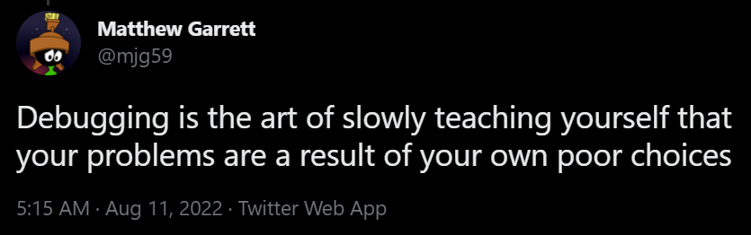
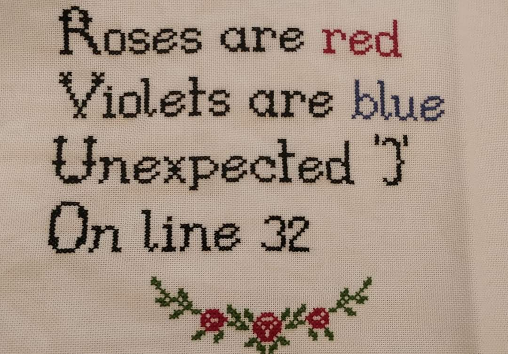
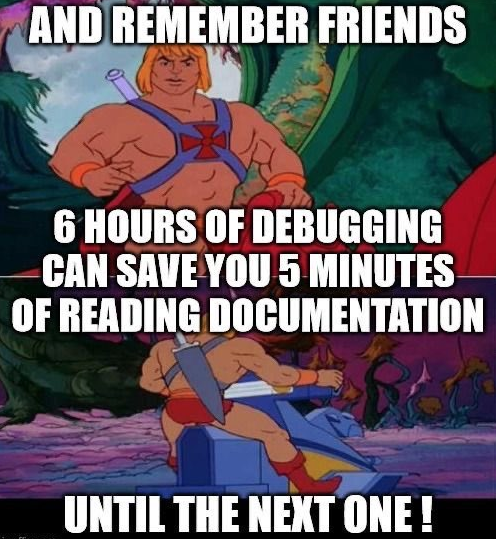
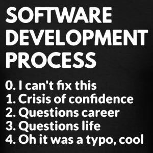
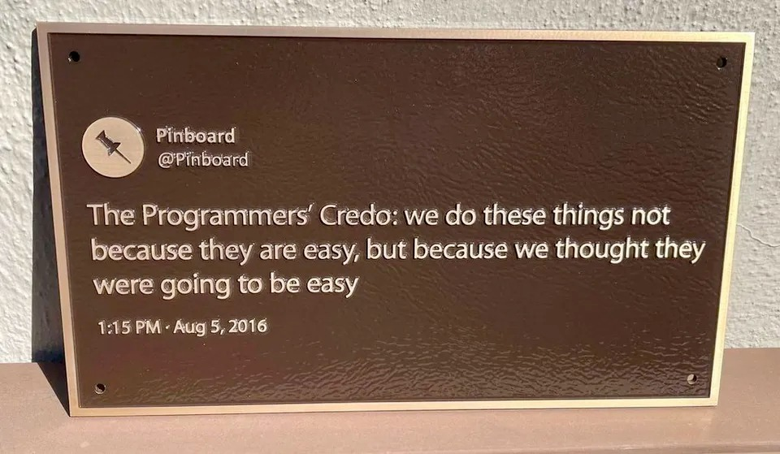
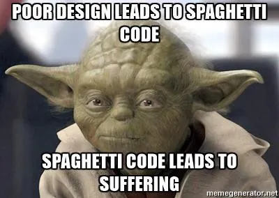
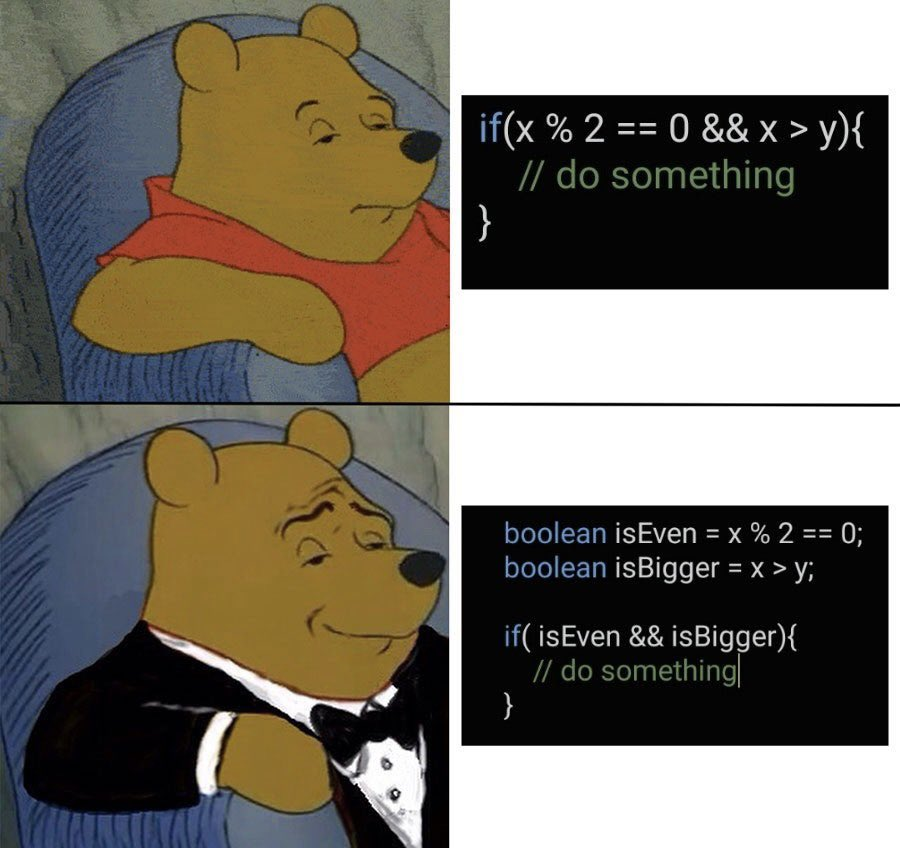
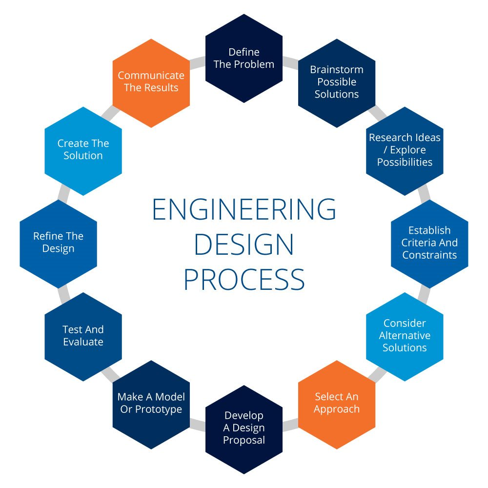

# Class 5

## 🛠️ Debugging

### Resources

* [p5js Debugging article](https://p5js.org/tutorials/field-guide-to-debugging/)
* [Errors in JavaScript](https://www.youtube.com/watch?v=O0EHKBi7iXU)
* ["Expert Software Developers' Approach to Error"](https://www.youtube.com/watch?v=UNMF5AS4SLg)
* [67 Weird Debugging Tricks Your Browser Doesn't Want You to Know](https://alan.norbauer.com/articles/browser-debugging-tricks)

### What to do when something doesn't work

* First steps:
  * Does your IDE point out any syntax problems?
  * Is there an error message in the console?
    * Is there a [stack trace](https://en.wikipedia.org/wiki/Stack_trace)?
  * Check your syntax
  * Check for typos
  * Are we editing the right file?
  * Are we observing the right server (e.g., localhost vs production)?
  * Is your code actually reloading?
    * Try restarting your development environment or server and clearing any caches
* Next steps:
  * Double-check the documentation
  * Do some Googling - has someone else had this problem?
  * Can you make a more basic version of the code do something?
  * Get help from AI 
* Still not working? Take a step back - is something obvious being overlooked?
  * Has something changed that seemed insignificant at the time?
  * Do you have a fairly unique issue, and if so, how can we work around it?

> An AI coding assistant is a great addition to your debugging toolkit. Let's keep in mind [Coding and learning with AI](../docs/learning-with-ai.md) - try to use AI as a learning tool to build our own debugging skills. AI can often explain your exact debugging situation very well, and this is incredibly helpful, but let's not rely on it exclusively; we should still strive to understand and solve problems independently.

### General debugging

* Reference errors (is your code operating to the right thing?)
  * Pointing by reference vs value
  * For example, .js String functions make copies, rather than mutate the original value
* `console.log()` / `println()`
  * Using multiple log calls can ensure that your code is executing, and in the expected order (See control flow below)
* Debuggers - live demo

### Graphical debugging

"Why aren't things drawing the way I expect them to?"

* It's hard, because there as less-obvious ways to identify a problem. Even if you can log something, it might not explain visual artifacts. 
  * There are very common issues with z-fighting, transparency, incorrect normals, and *lots* more that can make things look wrong, but without an obvious fix unless you've seen it before.
* If something isn't displaying, can you make a simpler version?
* Add a "debug view"
  * In GLSL (shaders), there's no textual logging or output, so developers will often draw various textures and stages of pixel operations to the screen to decipher what might be happening
  * Draw values to the screen via text of charts, since logging to the console can be too dense to track
  * [#debugviewart](https://www.instagram.com/explore/tags/debugviewart/)

## 🛠️ Software Design

How software works, and how to write better code 

Software design decisions happen at micro and macro levels inside of a single codebase. Every chunk of code can potentially use a different style of organizational pattern, from individual functions and classes, to representation of data and state, to larger system architecture. 

Knowing how a program executes helps you organize and structure your code as a reflection of how it should function. As you practice coding, your mental modeling will become more intuitive, but even senior engineers might take time to diagram and plan an approach before writing a single line of code. 

On top of learning any specific language, software design concepts are universal. The larger the codebase, the more consequential your software design choices become.

### How does a program execute?

- [Compiling vs Interpreting](https://dev.to/robiulhr/is-javascript-compiled-or-interpreted-language-l20)
- Entry point (main function)
- Basic [control flow](https://en.wikipedia.org/wiki/Control_flow) tools:
  - Functions
  - Conditionals (branching logic)
  - Loops
  - [Control flow diagram](../images/control-flow.png)
- Order of operations
  - In most languages, code executes serially by default. One operation needs to finish before the next starts.
  - *Multithreading* breaks out of the predictable order of execution and allows for more optimal performance, but at a cost of complexity and new pitfalls

### General advice for cleaner, better code

- Practice! Solving the same type of problem over time allows you to experiment with different approaches
- Ask for feedback from your peers or mentors (or AI)
- Refactor and clean up your own code once it's working. Can you find ways to make it simpler, cleaner, more reliable or efficient?
- Study common coding techniques. What are people in the industry talking & writing about?
  - Watch online lessons and talks from conferences
  - Read blog posts
  - Follow developers on social media

### Strategies

> As your codebase grows, it becomes increasingly important to organize your code using these strategies. This is how we avoid unmanageable and messy "[spaghetti code](https://en.wikipedia.org/wiki/Spaghetti_code)"

Use [Design patterns](https://refactoring.guru/design-patterns)
- It takes experience to know which might be best in a given situation, so start trying them out! Different parts of a program will benefit from different design patterns - they all work together, depending on the task at hand.
- Your AI coding assistant will implement these concepts. Just like humans, AI can create a mess of spaghetti, or really overengineer things. To avoid a vibe-coded mess, discuss the design of your software and explore different options for different parts of the code
- Applying design patterns to your code should make it more maintainable and modular, which will allow it to grown and evolve more seamlessly

Look for opportunities to [DRY](https://en.wikipedia.org/wiki/Don%27t_repeat_yourself) (Don't Repeat Yourself) up your code
- [Video: What is DRY code?](https://www.youtube.com/watch?v=HwTcjWtDAfc)
- [Article: "Is Your Code DRY or WET?"](https://dzone.com/articles/is-your-code-dry-or-wet)

SOLID principles
- [SOLID principles](https://stackoverflow.blog/2021/11/01/why-solid-principles-are-still-the-foundation-for-modern-software-architecture/)
- [The SOLID Principles in Pictures](https://medium.com/backticks-tildes/the-s-o-l-i-d-principles-in-pictures-b34ce2f1e898)
- [Applying SOLID principles in React](https://konstantinlebedev.com/solid-in-react/)

Defensive programming

Try [Refactoring](https://refactoring.guru/refactoring/what-is-refactoring) your code for better organization and code clarity. 

- Readability (see below)
- Comments
- Proper indentation
- OOP (classes) - [Example sketch](https://editor.p5js.org/cacheflowe/sketches/488Fdh1O1)
- Separate code into multiple files
  - ex. es6 module imports in modern JavaScript
- Use build scripts
- Use package managers

[When to refactor](https://refactoring.guru/refactoring/smells)?

- Your functions or classes are doing too much at once
- Your code has grown beyond several hundred lines of code
- Spaghetti has happened
- You don't even understand why your code works
- Cleanup before sharing your work 

### How to build anything

- 
- Break the problem down into smaller components
  - Plan for each component of the problem, then follow the process above
  - Writing and testing isolated code is a great way to solve these smaller, focused components
  - Build a larger plan to connect the smaller pieces - this is software design
  - Use a project management or task-tracking tool to keep track of your progress
- Write ugly code, then clean it up once it works
  - Don't over-engineer it until it's working
- Ask someone for help/advice!
- What happens when you hit a wall?
  - Sleep on it
  - Go for a walk
  - Use [a](https://en.wikipedia.org/wiki/Rubber_duck_debugging) [duck](https://rubberduckdebugging.com/)
  - Try a different approach or reduce your ambition this time around. You'll figure it out with persistence!
- Build your toolkit as you find solutions
  - [Haxademic](https://github.com/cacheflowe/haxademic/) is one of mine

## 📝 Homework

Read

- [So you want to build a generator](http://galaxykate0.tumblr.com/post/139774965871/so-you-want-to-build-a-generator) by Kate Compton
- [Shepherding Random Numbers](https://inconvergent.net/2016/shepherding-random-numbers/) by Inconvergent
- [Emergence and Generative Art](https://www.amygoodchild.com/blog/emergence) by Amy Goodchild
- [Randomness in the Composition of Artwork](https://tylerxhobbs.com/essays/2014/randomness-in-the-composition-of-artwork) by Tyler Hobbs
- [Probability Distributions for Algorithmic Artists](https://tylerxhobbs.com/essays/2014/probability-distributions-for-algorithmic-artists) by Tyler Hobbs
- [What makes generative art hard?](https://bendotk.com/writing/what-makes-generative-art-hard) by Ben Kovach

**Build a "generator"**

- Shapes
- Some ideas
  - [Basic example](https://editor.p5js.org/cacheflowe/sketches/JytAPkkLQ0)
  - Generate an environment
  - Or a character
  - Or a pattern
  - Or a particle system
  - Animate your generated visuals
  - Add sound!

Inspiration

- [Manolo](https://www.behance.net/manoloide) - [code](https://github.com/manoloide/AllSketchs)
- [Dave Bollinger](https://www.flickr.com/photos/davebollinger/)
- [Saskia Freeke: Patterns](http://sasj.nl/)
- [Andreas Gysin: Bots](https://www.instagram.com/p/B9KGXmNByRa/)
- [Everest Pipkin: Mirror Lake](https://everestpipkin.itch.io/mirrorlake)
- [Lolo Armdz](https://www.instagram.com/p/Bo9XS81HomN/)
- [Amanda Cifaldi: Tiny Spires](https://botsin.space/@tinyspires)
- [Cacheflowe: Branchers](https://www.threads.net/@cacheflowe/post/Cu0sWaTAX7R)
- [Kjetl Golid](https://www.instagram.com/p/B1FUsgSANMz/)
- [Frederik Vanhoutte](https://www.instagram.com/p/B9scpU8HgXY/)
- [Dmitri Cherniak](https://www.instagram.com/p/CDzmKONnAlj/)
- [Caleb Ogg](https://www.instagram.com/p/B_YjBSYnMn1/)
- fxhash archive
  - [KilledByAPixel](https://killedbyapixel.github.io/fxhashArchive/#/artist/tz1aFiCb7spiSAdkCYUwaFSLgr4qN9ceGn2b)
  - [flight404](https://killedbyapixel.github.io/fxhashArchive/#/artist/tz1YysAQDjxqh9AkQnSabKEXeUu4DuNng1pm)
  - [toxi](https://killedbyapixel.github.io/fxhashArchive/#/artist/tz1d4ThofujwwaWvxDQHF7VyJfaeR2ay3jhf)
  - [Panta Rei by Koboljka](https://killedbyapixel.github.io/fxhashArchive/#/token/panta-rei)

## 📋 Review code

- Present your animations
