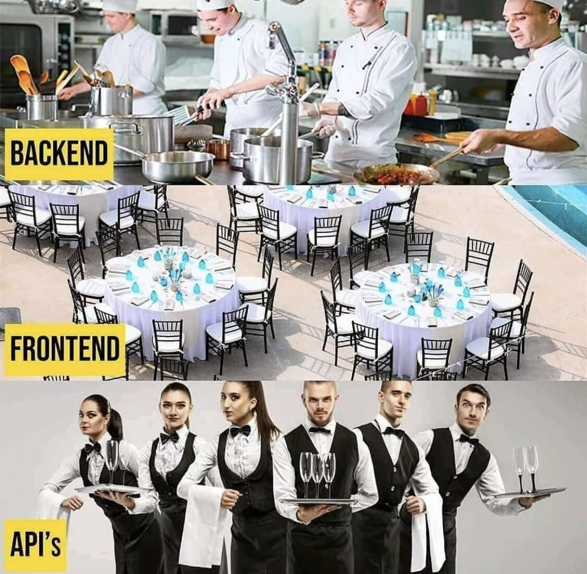
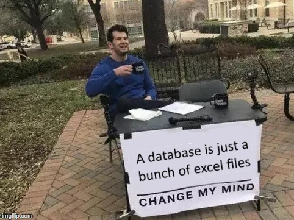
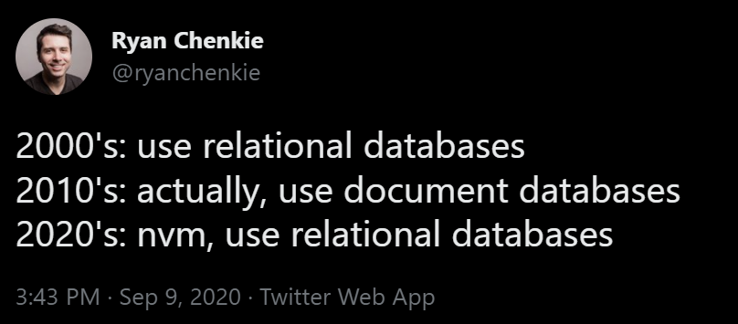
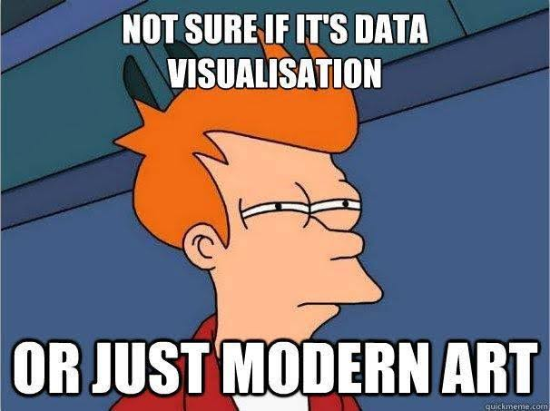

# Class 6

..or rather, you shouldn't!

## 🛠️ Data Structures

Common structured data types:

* [Arrays](https://www.youtube.com/watch?v=VIQoUghHSxU)
  * Indexed values (0, 1, 2, 3...)
  * Various ways of looping through arrays
    * `for` loop
    * `for...of` loop
    * `forEach()` method
    * `map()` method
  * Other [array functions](https://developer.mozilla.org/en-US/docs/Web/JavaScript/Reference/Global_Objects/Array)
* Dictionaries/Hashes ([Objects](https://www.youtube.com/watch?v=_5jdE6RKxVk) in .js, [HashMap](https://processing.org/reference/HashMap.html) in Java)
  * Key-value pairs rather than indexed values
  * Various ways of looping through objects
    * `for...in` loop
    * `Object.keys()` method
    * `Object.values()` method
    * `Object.entries()` method
* Other languages have other data structures
  * [Lists, Sets, Tuples, etc](https://www.w3schools.com/python/python_lists.asp) in Python
  * [Arrays, Vectors, Linked Lists, etc](https://www.geeksforgeeks.org/data-structures/) in C/C++
  * Structs, Enums, etc in Java/Rust/Go/Swift

Loading data payloads from external files or APIs
  * Text file
    * `loadStrings()` - [p5 example](https://p5js.org/reference/p5/loadStrings)
  * [CSV](https://www.howtogeek.com/348960/what-is-a-csv-file-and-how-do-i-open-it/) (spreadsheet/tabular data)
    * `loadTable()` - [p5 example](https://p5js.org/reference/p5/loadTable/)
  * [JSON](https://developer.mozilla.org/en-US/docs/Learn/JavaScript/Objects/JSON)
    * [json validator](https://jsonlint.com/)
    * [json tools](https://formatjsononline.com/)
    * `loadJSON()` - [p5 example](https://p5js.org/reference/p5/loadJSON/)
  * [XML](https://www.sitepoint.com/really-good-introduction-xml/)
    * `loadXML()` - [p5 example](https://p5js.org/reference/p5/loadXML/)
  

## 🛠️ APIs

* "[WTF is an API?](https://maggieappleton.com/api/)"
* Generally, we think about APIs as a way to read and write data from web servers, and JSON is the most common data transmission format. [REST](https://www.redhat.com/en/topics/api/what-is-a-rest-api) APIs and CRUD (Create, Read, Update, and Delete) operations are common patterns for interacting with APIs.
  * `loadJSON()` [demo](https://editor.p5js.org/cacheflowe/sketches/aHrrTAQFw)
  * vanilla `fetch()` [demo](https://editor.p5js.org/cacheflowe/sketches/FTI18-cxJ)
* But we can also think about the p5js framework's functions as an API - it's the instructions for how you use it. q5js is an example of swapping an API with a compatible alternative.
  * [q5.js](https://q5js.org/)
  * [q5 Example](https://editor.p5js.org/cacheflowe/sketches/IRhjHom9p)
* Even within our own codebase, we can think of an API as the way different parts of our code communicate with each other
  * [Example live-code](https://editor.p5js.org/cacheflowe/sketches/488Fdh1O1) w/collision detection on mouse position

---

## 🛠️ Databases

* Databases are searchable data structures 
* Relational & queryable databases allow for large sets of searchable data
  * Pro: More powerful and reliable than a data **file**
  * Pro: Hosted in the cloud, a db can share data between users
  * Pro: a db can handle many concurrent users and large volumes of data (think social media platforms)
  * Con: More difficult to set up and work with
  * Some different types of databases: SQL, Mongo (NoSQL), GraphQL (API layer)
* What's the best tool for the job?
  * Different database frameworks, just like languages, have their strengths and weaknesses, and are preferred by developers in certain contexts or industries
  * Just like languages, database tools experience shifts in popularity [over time](https://db-engines.com/en/ranking_trend)
  * 
* Data search [example](https://editor.p5js.org/cacheflowe/sketches/GOzYzYViFF) - this doesn't use a database, just a local data structure. But it demonstrates the basic principles of searching and filtering data that databases are really good at

---

## 🛠️ Data Visualization

* Types of data viz
  * [Traditional visual components](https://datavizproject.com/)
  * [Storytelling](https://www.youtube.com/watch?v=sFIDCtRX_-o)
  * [Art](https://www.youtube.com/watch?v=UxQDG6WQT5s)
* Data sources
  * [awesome-json-datasets](https://github.com/jdorfman/awesome-json-datasets)
    * you can append [.json to any subreddit url](https://www.reddit.com/r/science.json) (but this needs a proxy)
  * [public-apis](https://github.com/public-apis/public-apis)
  * [freepublicapis.com](https://www.freepublicapis.com/)
  * Topic-specific:
    * [OpenWeather](https://openweathermap.org/api)
    * [Spacekit](https://typpo.github.io/spacekit/)
* Data Viz drawing tools
  * [Make your own!](https://vimeo.com/showcase/2573675) - This is a Processing-specific series, but would port easily to p5js
  * [D3](https://d3js.org/)
  * [chart.js](https://www.chartjs.org/docs/latest/samples/information.html)
  * [Vizzu](https://lib.vizzuhq.com/latest/examples/presets/)
  * [deck.gl](https://deck.gl/)
  * Other [data viz libraries](https://medium.com/nightingale/navigating-the-wide-world-of-web-based-data-visualization-libraries-798ea9f536e7)
    * [More libraries](../images/chart-libraries.webp)
    * https://roughjs.com/
    * https://semiotic.nteract.io/
    * http://dimplejs.org/
    * https://vega.github.io/vega/
    * https://github.com/antvis/G2
    * https://plotly.com/javascript/

## 📝 Homework:

Watch:

* [The Pudding](https://pudding.cool/)
* [Daniel Shiffman: Introduction to Data and APIs in JavaScript](https://www.youtube.com/watch?v=rJaXOFfwGVw)
* [Giorgia Lupi: How we can find ourselves in data](https://www.youtube.com/watch?v=sFIDCtRX_-o)
* [Aaron Koblin: From Data to Digital Art](https://www.youtube.com/watch?v=-SETcTrdcU4)
* [Data Becomes Art in Immersive Visualizations](https://www.youtube.com/watch?v=99gMbK2QCKE)
* [Refik Anadol: Art in the age of machine intelligence](https://www.youtube.com/watch?v=UxQDG6WQT5s)

**Build a data visualization**

* Types of visuals to consider
  * A chart
  * An interactive visual representation
  * A storytelling device
  * An abstract interpretation of the data
* Data sources
  * Handcrafted/hard-coded arrays, objects
  * Loaded data files (json, csv, xml, text)
  * API requests
* Inspiration
  * [Nadieh Bremer](https://www.visualcinnamon.com/)
  * [Nicky Case](https://ncase.me/)
  * [Shirley Wu](https://shirleywu.studio/)
  * [Nicholas Felton: Annual Reports](http://feltron.com/FAR08.html)
  * [FlowingData](https://flowingdata.com/)
* Steps
  * Find or create some interesting data
  * Load your data source into your environment
  * Draw something based on your data

## 📋 Review code

* Present your generators
