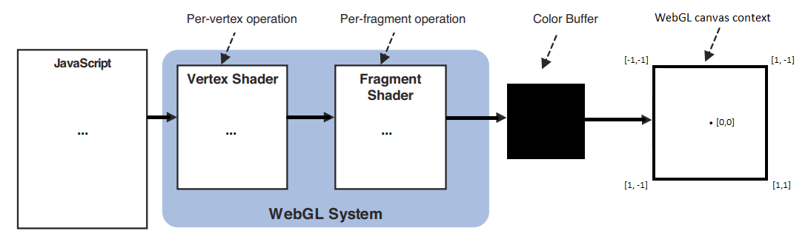

# Class 9

## 🛠️ 3D Graphics

The Graphics pipeline

* [How do Video Game Graphics Work?](https://www.youtube.com/watch?v=C8YtdC8mxTU)
* [Projection (3D)](https://jsantell.com/3d-projection)
* [WebGL Guide](https://xem.github.io/articles/webgl-guide.html)
* [Learn OpenGL](https://learnopengl.com/)

Basic layout & 3d thinking

* We're using an abstracted tool... It's just a 3rd coordinate ;)
* Live demos
  * [for() loops 3D](https://editor.p5js.org/cacheflowe/sketches/1S7L5IqjO)
  * [3d shapes basic](https://editor.p5js.org/cacheflowe/sketches/6jSCgZm0L)
  * [3d textured sphere w/light](https://editor.p5js.org/cacheflowe/sketches/LJJZUnd9_)
  * [Graphics & textured cube](https://editor.p5js.org/cacheflowe/sketches/T2VXcVI2A)
  * [Disable depth test](https://editor.p5js.org/cacheflowe/sketches/SW763JUky)

## CPU vs GPU

* What tasks are handled on each?
  * Shader code and pixel display operations are handled on the GPU
  * Most of the code that you write is on the CPU, unless you're writing shaders or OpenGL code
    * Under the hood of p5js & Processing, there's a ton of OpenGL/WebGL code, so know how this stuff works is helpful to know what your performance bottlenecks might be
* What's optimized on the GPU
  * It depends on the platform and tools
    * For example, certain parts of web browser rendering happen on the GPU, but differs per browser
  * Textures & texture operations
    * Loading an image file is almost always faster than drawing vector data
  * Cached Geometry with [p5.Geometry](https://p5js.org/reference/p5/p5.Geometry/) and [buildGeometry()](https://p5js.org/reference/p5/buildGeometry/)
  * 
* [cpu.land](https://cpu.land/)
* [CPU vs GPU vs TPU vs DPU vs QPU](https://www.youtube.com/watch?v=r5NQecwZs1A)

## 🛠️ Computer vision

* [@ Wikipedia](https://en.wikipedia.org/wiki/Computer_vision)
* p5js CV examples
  * https://github.com/kylemcdonald/cv-examples (need to change p5js version number)
* Processing OpenCV [library](https://github.com/atduskgreg/opencv-processing) - older classic CV algorithms
* Basic, [custom CV](https://cacheflowe.com/code/lab/webcam-experiments)
* Interesting cameras:
  * Depth ([Kinect](https://www.orbbec.com/products/tof-camera/femto-mega/) / [Realsense](https://www.intel.com/content/www/us/en/architecture-and-technology/realsense-overview.html))
  * [High framerate](https://www.edgertronic.com/)
  * [Thermal](https://groupgets.com/manufacturers/getlab/products/purethermal-2-flir-lepton-smart-i-o-module)
  * [Infrared](https://www.amazon.com/SVPRO-Outdoor-Waterproof-Surveillance-Android/dp/B07C2RL8PB/) (night vision)

## 🛠️ Computer vision in p5js

* [Mirrored webcam](https://editor.p5js.org/cacheflowe/sketches/zLpJ56Gi2) - (how to flip/mirror your webcam!)
* [MediaPipe multi-mode tracker](https://editor.p5js.org/orrkislev/sketches/wwLqrnVDt) - [original](https://editor.p5js.org/golan/sketches/0yyu6uEwM)
* ml5 [examples](https://editor.p5js.org/ml5/sketches)
  * [handPose-parts](https://editor.p5js.org/ml5/sketches/DNbSiIYKB)
  * [handPose-keypoints](https://editor.p5js.org/ml5/sketches/QGH3dwJ1A)
    * [More info](https://github.com/tensorflow/tfjs-models/blob/master/hand-pose-detection/README.md#keypoint-diagram)
  * [MediaPipe hand tracker](https://editor.p5js.org/lingdong/sketches/1viPqbRMv)
  * [faceMesh-shapes-from-parts](https://editor.p5js.org/ml5/sketches/6qj0M3ElM)
  * [faceMesh-parts-bounding-box](https://editor.p5js.org/ml5/sketches/F9jRILxn2)
  * [faceMesh-keypoints-from-parts](https://editor.p5js.org/ml5/sketches/EjynWxazD4)
  * [faceMesh-bounding-box](https://editor.p5js.org/ml5/sketches/fMCIspRD7_)
  * [bodySegmentation-select-body-parts](https://editor.p5js.org/ml5/sketches/R5rug0HKk)
  * [bodyPose-skeleton](https://editor.p5js.org/ml5/sketches/hMN9GdrO3)
  * [ml5.js PoseNet skeleton example](https://editor.p5js.org/codingtrain/sketches/ULA97pJXR)
  * [ml5.js BodyPix segmentation example](https://editor.p5js.org/cacheflowe/sketches/ezqWo10Ye)
  <!-- * [ml5.js + p5play game](https://editor.p5js.org/StevesMakerspace/sketches/RLGFfn2pt) -->
* [Teachable Machine](https://teachablemachine.withgoogle.com/) (code is downloadable)
* [Frame differencing example](https://editor.p5js.org/cacheflowe/sketches/NfXQSVwNmG)

## 📝 Homework:

Read:

* The WebGL & OpenGL articles above

Watch:

* [Best Of Demoscene 2020 (Playlist)](https://www.youtube.com/watch?v=zWqfX9J9BXI&list=PL9HVvEQXdWVb22aDO98yTbhqE8zy9XaDE)
* [SIGGRAPH 2020: Technical Papers Preview Trailer](https://www.youtube.com/watch?v=jYdMKdRUq_8)
* [SIGGRAPH 2019: Technical Papers Preview Trailer](https://www.youtube.com/watch?v=EhDr3Rs5fTU)
* [SIGGRAPH 2018 Asia: Technical Papers Preview Trailer](https://www.youtube.com/watch?v=wdKpXvF_3AU)

Listen to an episode from either podcast:

* [Tech+Art](https://podcasts.apple.com/ca/podcast/tech-art/id1480019037) Podcast
* [That's So New Media!?](https://open.spotify.com/show/7MXw99WToC4MbZHwAlaFzB?si=UggW_cRMTwmZKVWeVAfsjw&nd=1)

**Build something with 3D graphics or computer vision**

* 3D Graphics ideas
  * Start with WEBGL mode in p5js
    * This moves the coordinate system to the center of the screen
  * Use ox(), sphere() and other 3d primitive functions to create shapes
    * p5js has additional 3d shapes like 	orus()
* 3D Stretch goals
  * Create your own 3d geometry with eginShape(), ertex(), and ndShape()
  * Apply a texture to your geometry
  * Load a 3d model with loadModel()
  * Use a shader to create a custom material for your 3d geometry
* Computer Vision resources
  * [Video Capture example](https://p5js.org/examples/imported-media-video-capture/)
  * [ml5.js image classification](https://www.youtube.com/watch?v=pbjR20eTLVs)
    * From: [Beginners Guide to Machine Learning in JavaScript](https://www.youtube.com/playlist?list=PLRqwX-V7Uu6YPSwT06y_AEYTqIwbeam3y)
  * Processing: [Shiffman: Capture and Live Video](https://www.youtube.com/watch?v=WH31daSj4nc)
  * Processing: [Introduction to Webcam Effects with Processing](https://www.youtube.com/watch?v=6pGEk2dQnss)

## 📋 Review code

* Present your shader sketches
