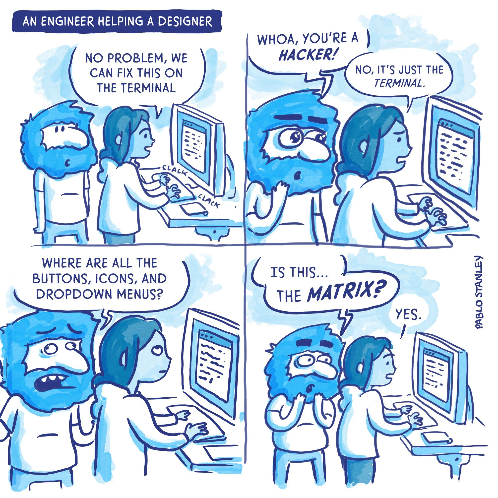
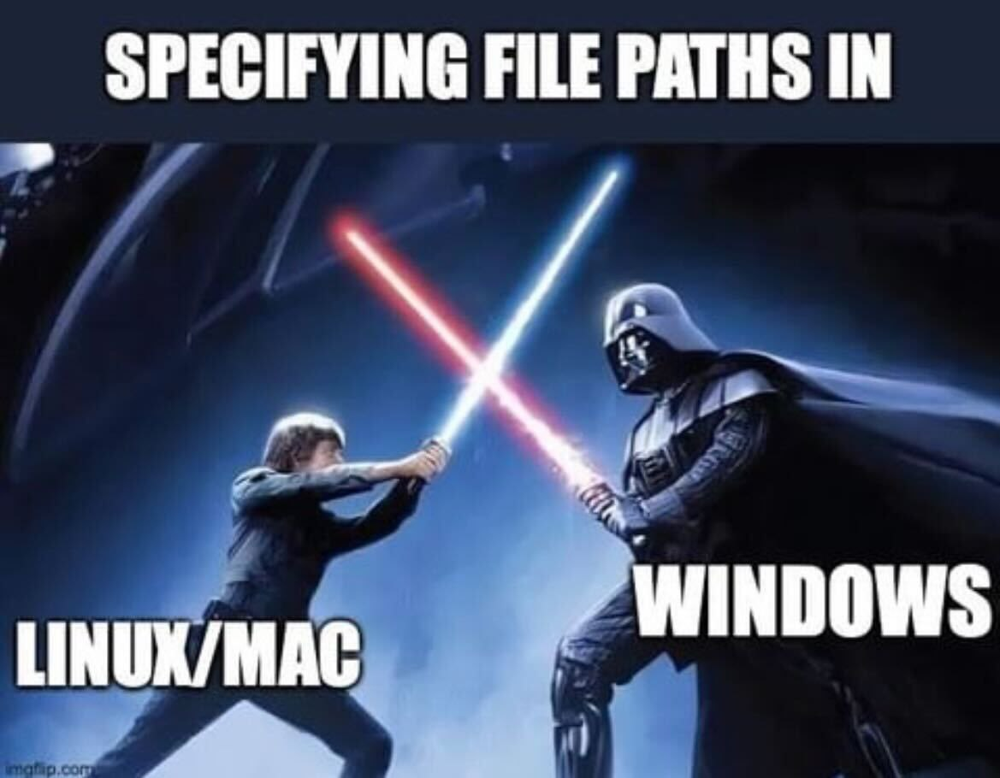
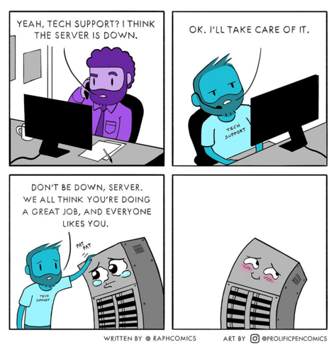

# Class 11

## 🛠️ Web Browsers

🎤 **Case study**: Wafflevision - a real project built on web tech, from prototype to deployed piece

Articles & resources

* https://wesbos.com/javascript/
* https://htmlforpeople.com/
* https://github.com/leonardomso/33-js-concepts
* https://alan.norbauer.com/articles/browser-debugging-tricks
* https://www.trevorlasn.com/blog/javascript-logical-operators

Creative Web Dev Studios

* [Active Theory](https://activetheory.net/)
* [Lusion](https://lusion.co/)
* [Resn](https://resn.co.nz/)
* [Unit9](https://www.unit9.com/digital)
* [Junni](https://next.junni.co.jp/)
* [MakeMePulse](https://www.makemepulse.com/)
* [RGA](https://www.rga.com/)
* [Media Monks](https://www.monks.com/)
* [Tool](https://toolofna.com/)
* [Wieden + Kennedy](https://wk.com/)
* [North Kingdom](https://www.northkingdom.com/)

The browser [console](https://creative-coding.decontextualize.com/browser-console/)

* Activity: alter the functionality of an existing site

SVG

* [two.js](https://two.js.org/) svg renderer
* [anime.js](https://animejs.com/) svg renderer & animation library
* [SVGomg](https://jakearchibald.github.io/svgomg/) svg optimizer

CSS

* [Enhancing User Experience With CSS Animations](https://stephaniewalter.design/blog/enhancing-user-experience-with-css-animations/)
* [CSS Doodle](https://css-doodle.com/) by [@yuanchuan](https://yuanchuan.dev/)
* [Ana Tudor](https://codepen.io/thebabydino)
* Drawing with [A Single Div](https://a.singlediv.com/)

Interesting Web [APIs](https://developer.mozilla.org/en-US/docs/Web/API) (check [caniuse.com](https://caniuse.com/))

* [Canvas API](https://flaviocopes.com/canvas/) ([Bitmap drawing docs](https://developer.mozilla.org/en-US/docs/Web/API/Canvas_API))
* [WebGL](https://webglfundamentals.org/) (High-performance 3d graphics)
* [DeviceOrientationEvent](https://web.dev/articles/device-orientation) (Accelerometer/gyroscope)
* [MediaDevices](https://developer.mozilla.org/en-US/docs/Web/API/MediaDevices) & [Media Streams API](https://developer.mozilla.org/en-US/docs/Web/API/Media_Streams_API) (Webcam, microphone, WebRTC streaming)
* [WebSockets API](https://developer.mozilla.org/en-US/docs/Web/API/WebSockets_API) (Persistent data streams)
* [Web Audio API](https://developer.mozilla.org/en-US/docs/Web/API/Web_Audio_API) (Audio playback/analysis/synthesis)
* [WebRTC](https://webrtc.org/) (Video/audio/data streaming)
* [WebXR](https://immersiveweb.dev/) (Build VR/AR/MR in-browser)
* [Web MIDI API](https://www.smashingmagazine.com/2018/03/web-midi-api/) (MIDI devices)
  * [JZZ](https://github.com/jazz-soft/JZZ)
* [Gamepad API](https://developer.mozilla.org/en-US/docs/Web/API/Gamepad_API) (Game controller devices)
* [Web Serial API](https://codelabs.developers.google.com/codelabs/web-serial/) (Serial devices like Arduino/Teensy)
* [Geolocation API](https://developers.google.com/web/fundamentals/native-hardware/user-location) (GPS)
* [Web Bluetooth](https://webbluetoothcg.github.io/web-bluetooth/)

Web-based creative tools & libraries:

* Realtime graphics libraries
  * [THREE.js](http://threejs.org/) and [react-three-fiber](https://github.com/pmndrs/react-three-fiber)
  * [Babylon.js](https://www.babylonjs.com/)
  * [PIXI.js](http://www.pixijs.com/)
  * [p5js](http://p5js.org/)
  * [two.js](https://two.js.org/)
  * [Paper.js](https://paperjs.org/)
  * [Regl: Functional WebGL](http://regl.party/)
  * [curtains.js](https://www.curtainsjs.com/)
  * [pts.js](https://ptsjs.org/)
  * [http://twgljs.org/](http://twgljs.org/)
  * [ogl.js](https://github.com/oframe/ogl)
  * [bauble](https://bauble.studio/)
* Live coding
  * [P5LIVE](https://teddavis.org/p5live/)
  * [Hydra](https://github.com/ojack/hydra)
  * [Hedron](https://github.com/nudibranchrecords/hedron)
* Audio (see [previous class](./class-07.md) for a list)
* Voice-recognition
  * [Web Speech API demo](https://mdn.github.io/web-speech-api/speech-color-changer/) (Chrome only)
* Face trackers
  * [MediaPipe](https://google-ai-edge.github.io/mediapipe-samples-web/#/vision/face_landmarker)
    * [TouchDesigner plugin](https://github.com/torinmb/mediapipe-touchdesigner)
  * [ml5](https://editor.p5js.org/ml5/sketches)
  * [face-api.js](https://github.com/justadudewhohacks/face-api.js)
  * [tracking.js](https://trackingjs.com/)
  * [WebGazer.js](https://webgazer.cs.brown.edu/)
* Body trackers
  * [ml5](https://editor.p5js.org/ml5/sketches)
  * [PoseNet](https://github.com/tensorflow/tfjs-models/tree/master/posenet)
  * [PoseNet for installations](https://github.com/oveddan/posenet-for-installations)
  * [Handtrack.js](https://github.com/victordibia/handtrack.js)
  * [YoHa](https://github.com/handtracking-io/yoha)
  * [MoveNet](https://blog.tensorflow.org/2021/05/next-generation-pose-detection-with-movenet-and-tensorflowjs.html)
  * [Mediapipe - Pose Landmark Detection](https://mediapipe-studio.webapps.google.com/studio/demo/pose_landmarker)
    * [BlazePose (3d)](https://blog.tensorflow.org/2021/08/3d-pose-detection-with-mediapipe-blazepose-ghum-tfjs.html)
* Fonts
  * [opentype.js](https://opentype.js.org/)
* Augmented/Mixed/Virtual Reality
  * [p5xr](https://p5xr.org/#/)
  * [WebXR](https://immersive-web.github.io/webxr/)
  * [AR.js](https://github.com/jeromeetienne/ar.js)
  * [8th Wall](https://www.8thwall.com/)
  * [Aframe](https://aframe.io)
  * [Native AR model viewer](https://cwervo.com/writing/quicklook-web/)
* Multi-user sync
  * WebSockets (small data packets)
    * [ws](https://www.npmjs.com/package/ws)
    * [Socket.io](https://socket.io)
    * [Croquet](https://www.croquet.io/)
  * WebRTC (data/video/audio streaming)
    * [PeerJS](https://github.com/peers/peerjs)
    * [Kurento](https://doc-kurento.readthedocs.io/en/stable/index.html)

## 🛠️ Command Line & Node.js

🎤 **Case study**: TB-y2k - a real Node.js/CLI project, live-coded - why a CLI tool made sense here, and how it fit into the larger pipeline

* A CLI (Command-Line Interface, vs. [GUI](https://en.wikipedia.org/wiki/Graphical_user_interface)) lets you run commands directly instead of clicking through an app
* Why it's worth knowing: automation (batch-processing files, running scripts on a schedule), scripting your own tools, and it's how most dev/build tooling (including 
pm, below) actually gets used
* Vibe coding tools like Gemini CLI, GitHub Copilot, & Claude Code are also offered as terminal applications

🔍 *Further (setup details - useful when you actually need them, not required reading now)*

* Shells: [Bash](https://www.gnu.org/software/bash/)/[zsh](http://zsh.sourceforge.net/) (Mac/Linux), [Powershell](https://learn.microsoft.com/en-us/powershell/scripting/overview)/[WSL](https://learn.microsoft.com/en-us/windows/wsl/install) (Windows)
* Package managers to install CLI tools: [Homebrew](https://brew.sh/) (Mac), [Chocolatey](https://chocolatey.org/)/[Scoop](https://scoop.sh/) (Windows), [apt](https://manpages.ubuntu.com/manpages/trusty/man8/apt.8.html) (Linux)
* Media conversion tools: [imagemagick](https://imagemagick.org/), [ffmpeg](https://ffmpeg.org/), [SoX](http://sox.sourceforge.net/), [media-utility-scripts](https://github.com/cacheflowe/media-utility-scripts)
* 

What is Node?

* [Node.js](https://nodejs.org/) is an open-source, cross-platform, back-end JavaScript runtime environment that runs on the V8 engine and executes JavaScript code outside a web browser.
* 
pm - Node Package manager
* package.json - project config file
  * 
pm install
  * 
pm run [command]
  * Use this [example project](https://github.com/benjaminmiles/react-three-vite) to try it out

Use cases

* Web Server & development tools
* WebSocket server
* Build tools & automations
* Batch file-processing tasks
* CLI tasks in a friendlier environment
* General plumbing to connect different apps (http requests, file handling, websocket connections, etc)

Node Resources

* [Node.js](https://nodejs.org/)
* [Introduction to Node.js](https://nodejs.org/en/learn/getting-started/introduction-to-nodejs)
* [Beginner's Series to: Node.js](https://www.youtube.com/playlist?list=PLlrxD0HtieHje-_287YJKhY8tDeSItwtg#begnodejs)
* [Node.js Ultimate Beginner's Guide in 7 Easy Steps](https://www.youtube.com/watch?v=ENrzD9HAZK4)
* [Node.js Tutorial for Beginners: Learn Node in 1 Hour](https://www.youtube.com/watch?v=TlB_eWDSMt4)
* [Build an API from Scratch with Node.js Express](https://www.youtube.com/watch?v=-MTSQjw5DrM)
* [Node Weekly](https://nodeweekly.com/)
* [The Coding Train topics](https://thecodingtrain.com/tracks/lang/all/topic/node-js)

## 📝 Homework:

Tutorial:

* [Browser console](https://creative-coding.decontextualize.com/browser-console/)

Read:

* Articles above on CSS and other web tech
* Research the enormous landscape of web-based creative tools

Watch:

* [Kate Compton: Creating generative art with Javascript](https://www.youtube.com/watch?v=tJ49bTJ6fbs)
* [Tim Holman - Generative Art Speedrun](https://www.youtube.com/watch?v=4Se0_w0ISYk)
* [Generative Machines with Matt DesLauriers](https://www.youtube.com/watch?v=8Uo6zFwSO78)

**Build something with a new (to you) Web Browser feature or Node.js**

* Find a tool or API above ☝️

## 📋 Review code

* Present your ML/Final project progress
