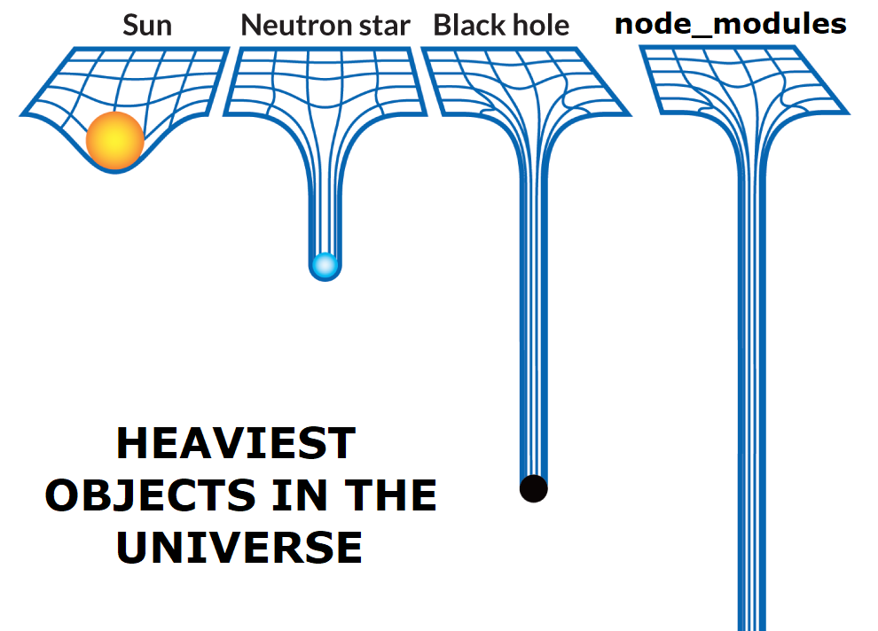

# Class 12

## 🛠️ Hardware

See also: [Creative Coding Notes list](https://github.com/cacheflowe/creative-coding-notes#physical-computing)

Some hardware needs special device drivers

* There's not a simple messaging scheme (like Serial communication) that you can replicate without major reverse-engineering. for example:
  * Kinect / Realsense
  * Leap Motion

Some hardware uses electrical signals and basic data transmission

* Arduino / Raspberry Pi sensors & output devices

## 🛠️ Integration & Networking

* Keyboard/mouse [HID](https://en.wikipedia.org/wiki/Human_interface_device) 
  * [xkeys devices](https://xkeys.com/xkeys.html)
  * [Arduino Leonardo](https://forum.arduino.cc/t/using-arduino-as-a-usb-hid/504918/7)
* Webcams - `[UVC](https://en.wikipedia.org/wiki/USB_video_device_class)` means that a camera of video device can be seen as a webcam by your operating system
* [MIDI](http://en.wikipedia.org/wiki/MIDI)
* Network protocols
  * [HTTP](https://medium.com/@jen_strong/the-request-response-cycle-of-the-web-1b7e206e9047)
  * [WebRTC](https://webrtc.github.io/samples/)
  * [WebSocket](http://en.wikipedia.org/wiki/WebSocket)
  * [OSC](http://en.wikipedia.org/wiki/Open_Sound_Control)
    * [osculator](https://osculator.net/)
  * [MQTT](https://en.wikipedia.org/wiki/MQTT)
  * [ZeroMQ](http://zeromq.org)
  * [UDP](https://www.cloudflare.com/learning/ddos/glossary/user-datagram-protocol-udp/)
* Serial I/O - This is how we talk to custom sensors via Arduino (or other PCB boards)
  * Example: [Epic React: Instant Go](https://cacheflowe.com/code/installation/epic-react-instant-go) treadmill
  * Example: [30 Years of Air](https://cacheflowe.com/code/installation/30-years-of-air) - sensor & motors
* Wireless protocols
  * [Bluetooth](https://developer.mozilla.org/en-US/docs/Web/API/Web_Bluetooth_API) (can be hard to work with)
  * [RFID](https://www.instructables.com/Arduino-Wiring-and-Programming-of-RFID-Sensor/)
    * [NFC](https://en.wikipedia.org/wiki/Near-field_communication)
  * [IR](https://roboticsbackend.com/arduino-ir-remote-controller-tutorial-setup-and-map-buttons/)
  * [Zigbee](https://docs.arduino.cc/retired/getting-started-guides/ArduinoWirelessShieldS2/)
* Lighting protocols
  * [ArtNet](https://en.wikipedia.org/wiki/Art-Net) ([Addressable LEDs](https://cacheflowe.com/code/lab/artnet-+-processing))
  * [DMX](https://en.wikipedia.org/wiki/DMX512) ([Example: Zoom simulation](https://cacheflowe.com/code/installation/zoom-centrifuge))
  * [sACN](https://www.lightjams.com/sacn.html)
  * [WLED](https://kno.wled.ge/)
* Shared textures between apps
  * [Spout](http://spout.zeal.co/)
  * [Syphon](http://www.syphon.v002.info/)
* Video streaming
  * [RTP](https://en.wikipedia.org/wiki/Real-time_Transport_Protocol)
  * [NDI](https://www.ndi.tv/)
  * [WebRTC](https://webrtc.org/)

You can use these protocols to create larger integrated systems!

## 🛠️ Open Source

Open source software (OSS) = Freely-available source code!

* Be aware of the different kinds of OSS [licenses](https://opensource.org/licenses)
  * These determine how you can (or can't) legally use the code in your projects. Make sure you're allowed to use the code for your commercial (or non-commercial) purposes.
* [How does open source happen?](http://opensource.guide/)
  * [Aligning an Open Source Ethos](https://opensourceethos.net/)
  * OS development [funding models](https://mkaz.blog/misc/open-souce-funding-models/)
  * Internal tools that become their own library, like [React](https://react.dev/) by Meta (Facebook)
  * Personal projects or tooling that the author wants to share
    * Mine is [Haxademic](https://github.com/cacheflowe/haxademic)
  * [What open source project should I contribute to?](https://kentcdodds.com/blog/what-open-source-project-should-i-contribute-to)
* The dark sides of open source
  * [The struggles of an open source maintainer](http://antirez.com/news/129) - being a OSS maintainer can be *difficult*
  * [Awful OSS Incidents](https://github.com/PayDevs/awful-oss-incidents) - open source can create security risks

Open source libraries & frameworks that you'll find

* Many popular OSS projects are either a library or a framework
* [What is the difference between a framework and a library?](https://www.youtube.com/watch?v=D_MO9vIRBcA)
* p5js is a larger **framework**, but has **[libraries](https://p5js.org/libraries/)** that can add extra functionality

Package (library) managers

* Why use a package (library) manager?
  * Quick & easy to add functionality to your project
  * Dependency management - any library you use may have its own dependencies, and the package manager will download (and solve version conflicts) for you
  * It's nice to have one source for the latest tools
* Downsides of package managers
  * [Writing Javascript without a build system](https://jvns.ca/blog/2023/02/16/writing-javascript-without-a-build-system/)
  * [Security risks](https://arstechnica.com/information-technology/2021/09/npm-package-with-3-million-weekly-downloads-had-a-severe-vulnerability/)
  * Large download size (with lots of extra library dependencies you might not use) 
  * Versioning/dependencies can break or become outdated over time 
* Different languages have different package managers
  * p5js: [Doesn't have one](https://p5js.org/libraries/)! You include remote javascript files or upload them
  * Processing & Arduino: library manager inside IDE
  * Javascript: npm
  * Java: Maven or Gradle
  * Ruby: Bundler
  * Python: pip or conda
  * OS X: Homebrew
  * Windows: Chocolatey

## 📝 Homework:

Listen to an episode from either podcast:

* [Tech+Art](https://podcasts.apple.com/ca/podcast/tech-art/id1480019037) Podcast
* [That's So New Media!?](https://open.spotify.com/show/7MXw99WToC4MbZHwAlaFzB?si=UggW_cRMTwmZKVWeVAfsjw&nd=1)

**Build something with hardware or explore an open source project**

* Hardware ideas
  * p5js: use the [Web Serial API](https://web.dev/serial/) with [Justin's example sketch](https://editor.p5js.org/cacheflowe/sketches/F7GG8vuEy) (Chrome only)
    * Show example video
  * Processing: use the Serial library
  * MIDI (Chrome only)
    * [Justin's example sketch](https://editor.p5js.org/cacheflowe/sketches/xuGYeJnZY)
    * [Justin's example sketch 2](https://editor.p5js.org/cacheflowe/sketches/iFMtaetat)
* Open Source ideas
  * Find an interesting open source project and explore its code
  * Contribute to an open source project
  * Start your own open source project

## 📋 Review code

* Present your web browser/Node.js projects
