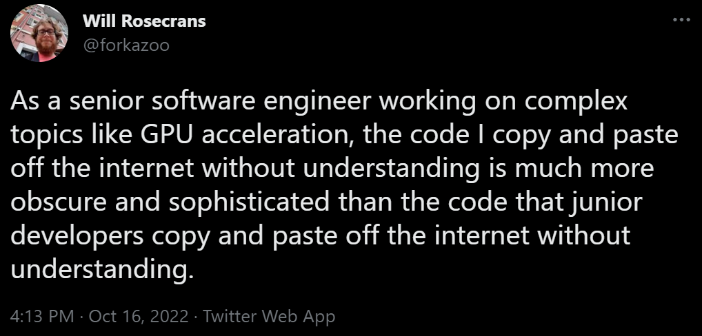

# Class 13

## 📋 Faculty Course Questionnaire (FCQ)

* 15 minutes at the beginning of class for students to complete their online FCQs
* The purpose of the FCQ, how it's used in your course and department, and highlight its importance to you.
* Visit [https://colorado.campuslabs.com/eval-home/](https://colorado.campuslabs.com/eval-home/) using a phone, tablet or computer. They will need to authenticate using their campus user ID.

## Where are we?

- Last class before final project presentations!
- Final project presentations in our last class, with the final due date in Canvas the week of finals. Check Canvas assignments!
- Office hours this week will be focused on final projects
  - I'll be available on Slack and could set up Zoom calls if needed
- Any questions about final projects?

## Jobs

Let's talk about [jobs](../docs/jobs.md)!

## 📝 Homework:

* Work on your final project
* I can stay late to talk about your project. Otherwise, stop by office hours if you have questions
* Prepare to present your final project in our last class

## 📋 Review code

* Present your hardware/open source projects
* Final project help & planning
